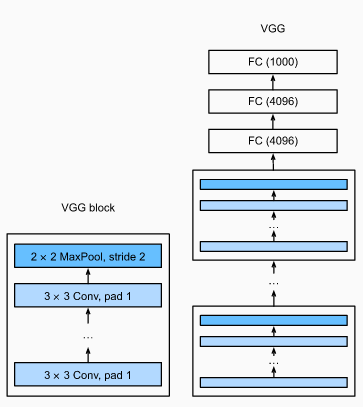
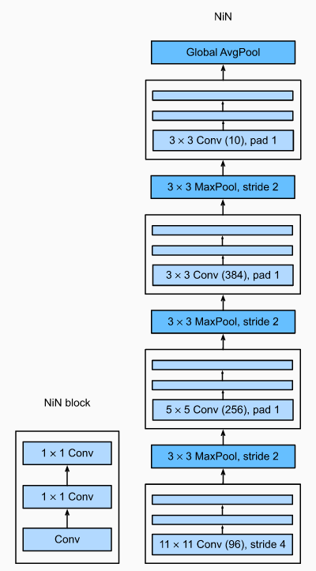
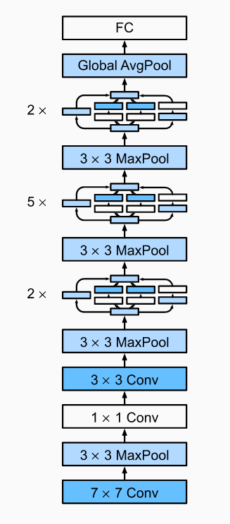

# 9. Modern Convolutional Neural Networks

## 9.1 AlexNet

The design philosophies of AlexNet and LeNet are very similar, but there are also significant differences. First, AlexNet is much deeper than the comparatively small LeNet5.

**Activation functions:**  AlexNet changed the sigmoid activation function to a simpler ReLU activation function. On one hand, the computation of the ReLU activation function is simpler. On the other hand, the ReLU activation function makes model training easier when using different parameter initialization methods. This is because, when the output of the sigmoid activation function is very close to 0 or 1, the gradient of these regions is almost 0, so that backpropagation cannot continue to update some of the model parameters.

**Preprocessing:** AlexNet controls the model complexity of the fully-connected layer by dropout. To augment the data even further, the training loop of AlexNet added a great deal of image augmentation, such as flipping, clipping, and color changes.

## 9.2 VGG

One VGG block consists of a sequence of convolutional layers, followed by a max pooling layer for spatial downsampling.

The original VGG network had 5 convolutional blocks, among which the first two have one convolutional layer each and the latter three contain two convolutional layers each. The first block has 64 output channels and each subsequent block doubles the number of output channels, until that number reaches 512. Since this network uses 8 convolutional layers and 3 fully-connected layers, it is often called VGG-11.

## 9.3 Network in Network (NiN)

LeNet, AlexNet, and VGG all share a common design pattern: extract features exploiting spatial structure via a sequence of convolution and pooling layers and then post-process the representations via fully-connected layers. Alternatively, one could imagine using fully-connected layers earlier in the process.

The idea behind NiN is to apply a fully-connected layer at each pixel location (for each height and width). If we tie the weights across each spatial location, we could think of this as a 1×1 convolutional layer or as a fully-connected layer acting independently on each pixel location.

One significant difference between NiN and AlexNet is that NiN avoids fully-connected layers altogether. Instead, NiN uses an NiN block with a number of output channels equal to the number of label classes, followed by a global average pooling layer, yielding a vector of logits.

## 9.4 Networks with Parallel Concatenations (GoogLeNet)

**Inception blocks**: the outputs along each path are concatenated along the channel dimension and comprise the block’s output. The commonly-tuned hyperparameters of the Inception block are the number of output channels per layer.

To gain some intuition for why this network works so well, consider the combination of the filters. They explore the image in a variety of filter sizes.

GoogLeNet uses a stack of a total of 9 inception blocks and global average pooling to generate its estimates. Maximum pooling between inception blocks reduces the dimensionality. The global average pooling avoids a stack of fully-connected layers at the end.

## 9.5 Batch normalization

Batch normalization, a popular and effective technique that consistently accelerates the convergence of deep networks.

* Intuitively, this standardization plays nicely with our optimizers because it puts the parameters a priori at a similar scale.

* The variables in intermediate layers may take values with widely varying magnitudes

* Deeper networks are complex and easily capable of overfitting.

Batch normalization is applied to individual layers:
In each training iteration
1. Normalize the inputs (of batch normalization) by subtracting their mean and dividing by their standard deviation, where both are estimated based on the statistics of the current minibatch.

2. we apply a scale coefficient and a scale offset. It is precisely due to this normalization based on batch statistics that batch normalization derives its name.

One takeaway here is that when applying batch normalization, the choice of batch size may be even more significant than without batch normalization.

Note that γ and β are parameters that need to be learned jointly with the other model parameters.

* **FC Layers:** batch normalization is applied after the affine transformation and before the nonlinear activation function.

* **Conv Layers:** batch normalization is applied after the convolution and before the nonlinear activation function. When the convolution has multiple output channels, we need to carry out batch normalization for each of the outputs of these channels, and each channel has its own scale and shift parameters, both of which are scalars.

Typically, after training, we use the entire dataset to compute stable estimates of the variable statistics and then fix them at prediction time. Consequently, batch normalization behaves differently during training and at test time.

## 9.6 ResNet
Residual block:

The first two layers of ResNet are the same as those of the GoogLeNet: the 7×7 convolutional layer with 64 output channels and a stride of 2 is followed by the 3×3 maximum pooling layer with a stride of 2. The difference is the batch normalization layer added after each convolutional layer in ResNet.

## 9.7 DenseNet

The key difference between ResNet and DenseNet is that in the latter case outputs are concatenated rather than added.

In terms of implementation this is quite simple: rather than adding terms, we concatenate them.

The name DenseNet arises from the fact that the dependency graph between variables becomes quite dense. The last layer of such a chain is densely connected to all previous layers.

